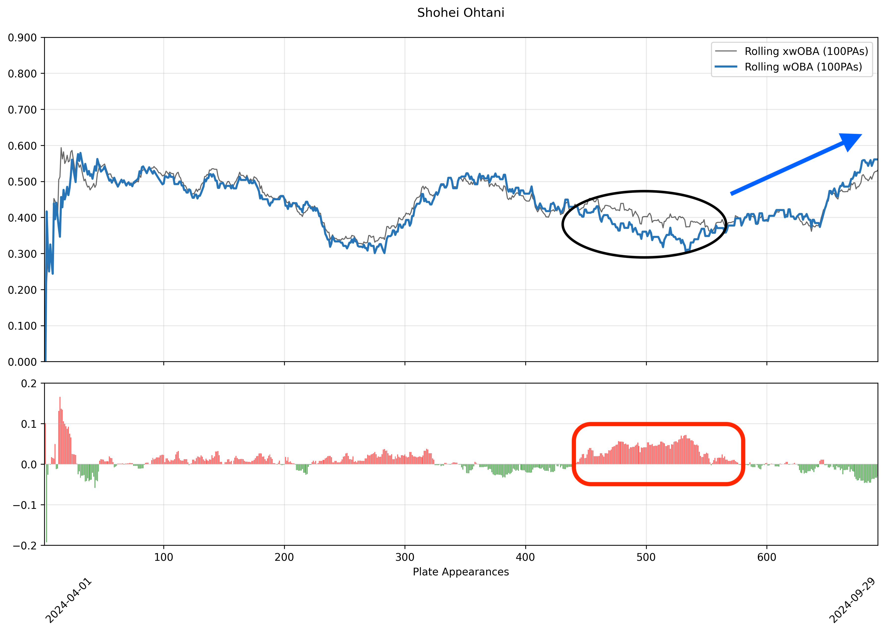
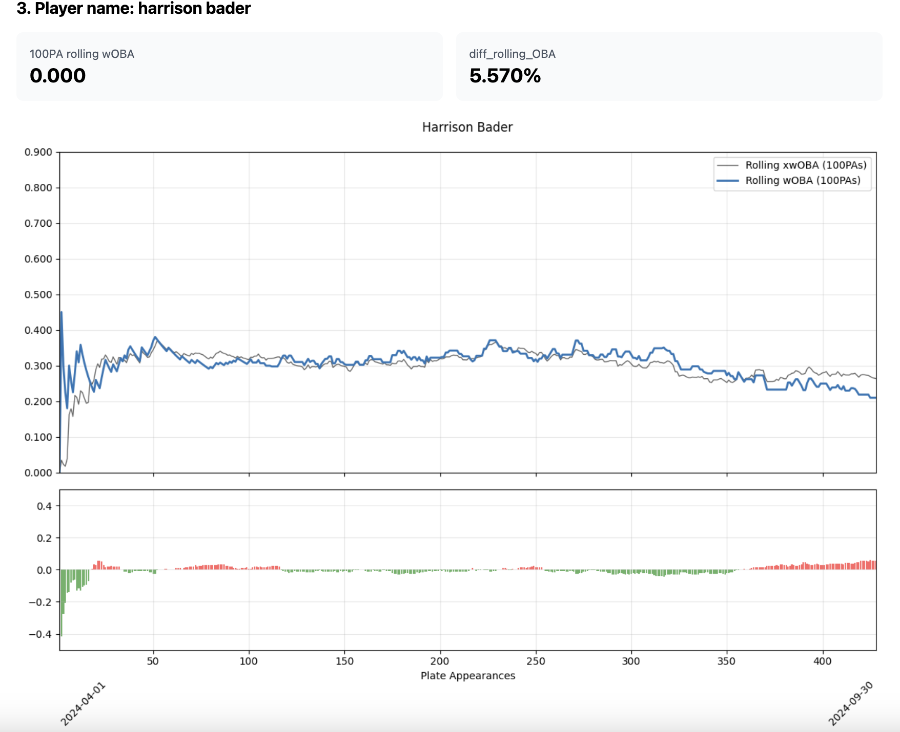

# MLB Underestimated Player Analyzer

A data-driven analytics tool that identifies underestimated MLB players by analyzing the gap between actual (wOBA) and expected (xwOBA) performance metrics. This project helps teams and analysts discover players who are performing above expectations but might be flying under the radar.

## What This Project Does

This project analyzes MLB player performance using three key metrics:

### Understanding the Metrics

**wOBA (Weighted On-Base Average)**
- A comprehensive offensive metric that measures a player's overall batting performance
- Weights different offensive events (singles, doubles, walks, etc.) based on their run value
- Used by MLB teams to evaluate offensive contribution more accurately than traditional batting average

**xwOBA (Expected Weighted On-Base Average)**
- Calculates what a player's wOBA "should be" based on quality of contact
- Uses exit velocity and launch angle data to predict outcomes
- Helps eliminate luck and defense from evaluation
- Widely used on Baseball Savant for player projection

**diff_rolling_OBA (Our Innovation)**
- Measures the difference between rolling wOBA and xwOBA over 100 plate appearances
- Positive values: Player is outperforming expectations
- Negative values: Player is underperforming expectations
- Helps identify players whose true talent level might be underestimated

## Development Process

This project was developed through human-AI collaboration:

1. **Problem Definition & Planning**
   - I identified the need for underestimated player analysis
   - Specified the required metrics (wOBA, xwOBA, diff_rolling_OBA)
   - Outlined desired visualizations and functionalities

2. **AI-Assisted Development**
   - Claude (AI) wrote the initial code based on requirements
   - Generated Python scripts for data processing and analysis
   - Created visualization modules and web interface
   - Suggested improvements and optimizations

3. **Human Review & Testing**
   - I reviewed all generated code for accuracy and efficiency
   - Tested functionality with real MLB data
   - Provided feedback for improvements
   - Validated statistical calculations
   - Fine-tuned visualizations and interface

This iterative collaboration combined AI's coding capabilities with human baseball knowledge and testing to create a robust analytics tool.

## Project Components

### baseball_workflow.py
- Main orchestration script
- Manages data pipeline
- Handles API endpoints
- Controls data refresh cycle

### baseball_plotting.py
- Creates performance visualizations
- Generates trend analysis charts
- Produces daily player comparison graphs

### baseball_ranking.py
- Calculates player rankings
- Identifies underestimated players
- Generates performance differentials
- Produces daily leaderboards

## Project Outputs

The system produces:
- Daily rankings of underestimated players
- Performance trend visualizations
- Web-based dashboard interface

## Current Limitations

1. **Infrastructure Constraints**
   - Limited to local deployment
   - No cloud hosting currently available
   - Manual data refresh required

2. **Technical Constraints**
   - Processing capacity limited by local hardware
   - Basic web interface
   - No real-time updates

## Future Development

We welcome contributors who are passionate about baseball analytics! Key areas for improvement include:

### Integration Goals
- Direct connection with Baseball Savant API
- Real-time data processing
- Cloud deployment infrastructure

### Feature Wishlist
- Advanced statistical modeling
- Player comparison tools
- Historical trend analysis
- Mobile-friendly interface

## Contributing

Contributions are what make the open source community such an amazing place to learn, inspire, and create. Any contributions you make are **greatly appreciated**.

Contributions are always welcome!

My dream is to see this project become part of Baseball Savant's platform, enhancing MLB's analytics capabilities.

Don't forget to give the project a star! Thanks again!

Contact: lch99310@gmail.com

## License

This project is licensed under the MIT License.

---
⚾ Built with passion for baseball analytics